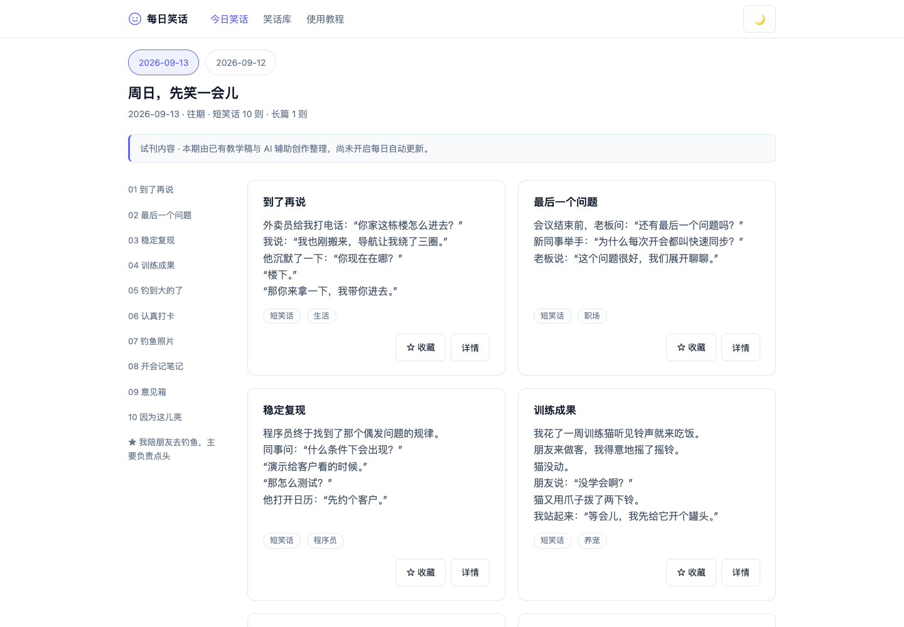
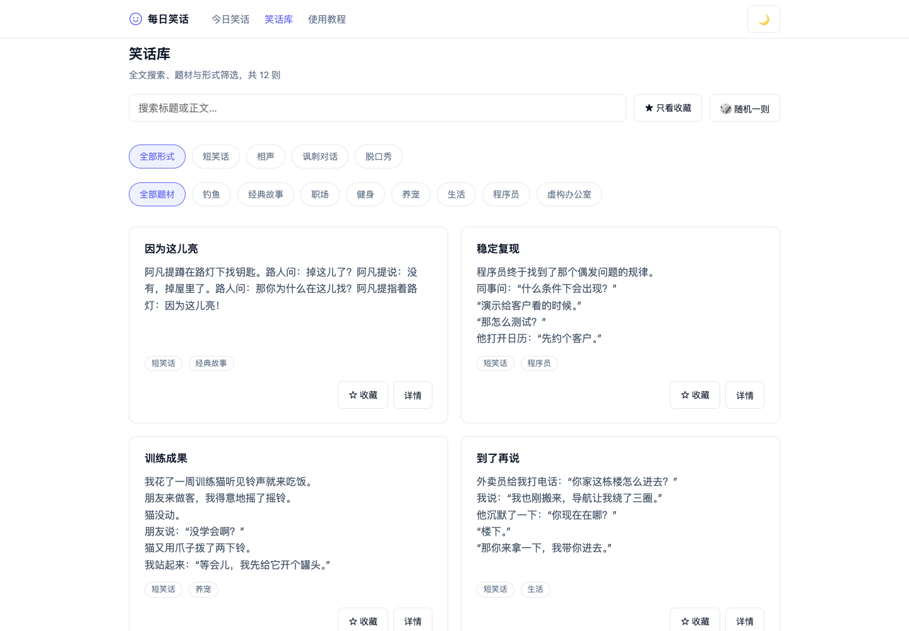

# 每日笑话（joke-hub）

Next.js App Router + TypeScript 的轻量中文笑话小站。

> **当前状态（如实说明）**：站点内容为**已审核的演示内容**（`content/seed.json`，12 条），自动采集调度**未启用**——仓库内没有任何定时任务、爬虫或采集脚本在运行。新内容只能通过手动执行 `content:import` 导入。

## 界面预览

按日期查看每天的内容，点击目录跳到对应笑话。





## 环境要求

- **Node.js 24+**（必须：存储层依赖 Node 24 内置的 `node:sqlite`，低版本无法启动）
- npm 10+

可用 `nvm use` 读取仓库内的 `.nvmrc` 自动切换版本。

## 本地部署

```bash
git clone https://github.com/wekobear/joke-hub.git
cd joke-hub
npm ci             # 按 package-lock.json 精确安装依赖
npm run dev        # 开发模式，http://127.0.0.1:4310
```

生产构建与启动：

```bash
npm run build
npm start          # http://127.0.0.1:4310
```

首次启动时，若数据库为空会自动从 `content/seed.json` 幂等导入演示内容（只初始化一次）。

## Netlify 部署（未配置 Supabase 时为演示模式）

仓库根目录的 `netlify.toml` 已完成适配，推送到 GitHub 后在 Netlify 关联该仓库即可自动连续部署（主分支 `main`）：

- **构建**：`npm run build`，Node 24（`NODE_VERSION=24`，满足 `node:sqlite` 要求）。注意：`netlify.toml` 中的环境变量**仅构建期生效，不进入 Functions 运行时**（官方环境变量文档）；运行时通过平台注入的站点元数据（`NETLIFY=true` / `SITE_ID` + `SITE_NAME`）识别 Netlify 环境，自动回退临时目录 SQLite
- **框架适配**：通过 `netlify.toml` 显式启用官方 `@netlify/plugin-nextjs` 适配器，兼容源码上传构建与 Git 构建
- **数据**：Netlify 函数无持久磁盘，部署后为**只读种子演示**——SQLite 库在函数实例临时目录从打包内嵌的 `content/seed.json` 自动初始化，浏览、搜索、API 均正常可用
- **内容更新**：修改 `content/seed.json`（或本地导入后同步）并提交推送，Netlify 会重新构建部署

### 部署模式内容限制（如实说明）

- 服务端数据库为临时目录、不跨实例持久：通过 API 的写路径本就不对外开放，收藏、下载等浏览器端功能不受影响（收藏保存在 localStorage）
- 自动采集仍未启用，线上内容 = 仓库内种子内容
- 需要完整本地体验（可导入新内容）请使用上面的本地部署方式

## 浏览与日期切换

首页（`/`）自带**期次日期导航**：页面以列表形式列出所有已有期次，点击日期即可切换查看对应一天的笑话，支持 `/?date=YYYY-MM-DD` 直达。默认展示最新有内容的一期。该导航为现有功能，无需额外配置。

另有页面：

- `/library` — 笑话库、搜索、筛选与收藏（收藏保存在当前浏览器）
- `/jokes/[id]` — 单条笑话详情
- `/skill` — 技能包介绍与下载

## 内容导入

```bash
npm run content:import -- path/to/issue.json
```

- 增量 upsert：旧条目保留、同 id 覆盖
- 事务校验：非法文件整体回滚，不影响已有数据
- 云端模式支持 `--status draft|published`；未指定时新内容默认发布、已有内容保留状态。本地 SQLite 模式不支持该参数
- 导入文件需符合 `lib/content-schema.ts` 定义的格式，导入器会在写入前验证整个文件；`npm run issue:check` 仅检查仓库自带的首期内容

## 只读 API

- `GET /api/v1/jokes?q=&category=&format=&page=1&limit=20` → `{items,total,page,limit}`（limit ≤ 50，q ≤ 100 字符；`favorites=` 空值表示「空收藏集合」，返回空结果）
- `GET /api/v1/daily?date=YYYY-MM-DD` → `{issue,items}`；不带 date 返回最新有内容一期；无效期次 404
- `GET /api/v1/jokes/[id]` → `{item}`
- `GET /api/v1/random` → `{item}`（仅短笑话）

非法分页 / 日期返回 400。

## 存储

Node 24 自带 `node:sqlite`（DatabaseSync），库文件默认 `data/jokes.sqlite`（已 gitignore），可用环境变量 `JOKES_DB_PATH` 指定其他路径（测试/持久化，优先级最高）；未设置时通过站点元数据（`NETLIFY=true`，或 `SITE_ID` + `SITE_NAME` 同时存在）识别 Netlify 运行时并自动回退系统临时目录。种子 `content/seed.json` 只在真正空库时初始化一次，之后的修改仅由显式 `content:import` 控制。全部 SQL 集中在 `lib/store.mjs`（CLI 与网站共用），`lib/db.ts` 为 server-only 包装。

## Supabase 持久化（可选，0.3.0 起）

不配置任何 Supabase 环境变量时，站点保持本地 SQLite 模式，行为与 0.2.x 完全一致。配置了 Supabase 后，所有读取走 Supabase REST（PostgREST），受 RLS 限制只能读到 `published` 内容；写入只通过 CLI 的单事务 RPC。**配置不完整（例如只设了 key 没设 URL）会明确报错，不会静默回退 SQLite。**

### 1. 创建 Supabase 项目

在 [supabase.com](https://supabase.com) 创建免费项目（无需信用卡，无定时付费服务）。

### 2. 应用 SQL 迁移

打开项目 Dashboard → **SQL Editor**，粘贴 `supabase/migrations/` 下的迁移文件全部内容并执行。它创建 `joke_jokes` / `joke_issues` / `joke_issue_jokes` / `joke_metadata` 四张表（独立于其他项目的表，均带 `joke_` 前缀），启用 RLS，并创建仅 `service_role` 可执行的导入 RPC `joke_import_content`。也可以用 Supabase CLI：`npx supabase link` 后 `npx supabase db push`。

### 3. 配置环境变量

```bash
cp .env.example .env   # 填入以下三项（Dashboard → Project Settings → API）
```

| 变量 | 用途 | 说明 |
| --- | --- | --- |
| `SUPABASE_URL` | 读取 + 写入 | Project URL |
| `SUPABASE_ANON_KEY`（或 `SUPABASE_PUBLISHABLE_KEY`） | 站点读取 | 受 RLS 限制仅 published；legacy JWT 与新版 publishable key 均支持 |
| `SUPABASE_SERVICE_KEY`（Secret key） | 仅 CLI 导入 | 服务端专用，绝不进入前端或网站运行时 |

本地开发 Next.js 会自动读取 `.env`；Netlify 上仅配置 `SUPABASE_URL` 与读取用的 `SUPABASE_ANON_KEY`（或 `SUPABASE_PUBLISHABLE_KEY`），范围包含 Functions。`SUPABASE_SERVICE_KEY` 只留在受控的本地入库环境，不配置到网站。入库和验收命令会自动加载当前目录的 `.env`。

### 4. 内容入库

```bash
npm run content:import -- content/seed.json                 # 自动选择：配置了 Supabase 即走云端
npm run content:import -- content/seed.json --local         # 强制本地 SQLite
npm run content:import -- new-issue.json --status draft     # 先入库不公开（仅云端模式）
npm run content:import -- new-issue.json --status published # 将草稿发布
npm run content:import -- new-issue.json                    # 新行发布，已有行保留状态
```

导入为增量 upsert：旧条目保留、同 id 覆盖，期刊关联按该期整体替换，整个包在单个事务 RPC 内写入，失败即整体回滚。`status` 语义：

- **不带 `--status`**：新行默认 `published`（老内容包行为不变）；包内已有条目保留当前 `status`——在 Table Editor 里改成 draft 的条目不会被重新导入复活。
- **`--status draft`**：本包所有行（含已有条目）置为 draft，先入库不公开。
- **`--status published`**：本包所有行置为 published——这是 draft 内容的发布通道。

`--status` 仅在 Supabase 模式支持；本地 SQLite 模式带 `--status` 会明确报错，不会静默按公开处理。

### 5. 查看与管理

- 公开浏览：直接打开网站（配置 env 后自动走云端），或 Dashboard → Table Editor 查看 `joke_*` 表
- 发布/下线：Table Editor 中把对应行的 `status` 在 `draft` / `published` 间切换即可，无需额外后台；draft 内容对网站与 API 完全不可见
- 无需配置任何定时任务或付费服务；后续自动发布可在现有 CLI 之外自行调度 `content:import`

### 6. 云端验收（可选）

```bash
npm run supabase-verify
```

需要真实凭据，验证迁移已应用、导入幂等、draft 隔离（详情/搜索/随机/列表均不可见 draft）与 RPC 仅 service_role 可执行。缺凭据时明确退出，不做模拟验收。

## 技能包

`public/downloads/jokes-v0.5.0.zip` 为现有真实 Skill 包，/skill 页面提供下载，并在页面上展示两条用途路线（网页订阅浏览 / 导入本地 Skill 使用）。不提供在线打包生成命令。`public/examples/` 下为真实演示视频。

## 许可

代码以 [MIT License](./LICENSE) 许可发布。种子内容与下载包中的笑话文本、演示视频等外部引用内容的权利归原作者所有，MIT 许可不覆盖这些内容——再分发前请自行确认相应授权。
